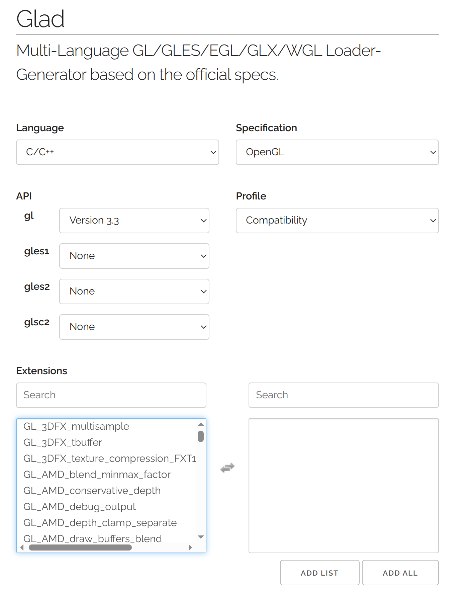

# Linux環境でのOpeGL導入
1. セットアップもろもろ  
```
sudo apt-get install cmake pkg-config
sudo apt-get install mesa-utils libglu1-mesa-dev freeglut3-dev mesa-common-dev 
sudo apt-get install libglew-dev libglfw3-dev libglm-dev 
sudo apt-get install libao-dev libmpg123-dev
mkdir lib && cd lib
sudo git clone https://github.com/glfw/glfw.git
sudo chmod -R a+rwx glfw
cd glfw
cmake .
make
sudo make install
```
2. GLADの生成  
   リンク先で画像ように設定して下にスクロールして```GENERATE```でzipファイルを生成
[Download GLAD](https://glad.dav1d.de/)

3. 適切に配置  
   zipファイルを展開するとincludeとsrcの２つのフォルダがある。src内のglad.cは作業用のディレクトリへ移す。include内のKHRフォルダとgladフォルダは```/usr/include```内に配置する。
   ```sudo cp -R include/* /usr/include/```
4. 作業用ディレクトリでコンパイル  
   ```sudo g++ (fail_name) glad.c -ldl -lglfw```