# TinyPaint 🎨

---

### **Colors**

* **White (0):** Eraser 🧼 (Overwrites with the background color)
* **Black (1):** Standard drawing color
* **Red (R):** Red drawing color
* **Green (G):** Green drawing color
* **Blue (B):** Blue drawing color

---

### **Brush Size**

Select a size from **2 to 8** to directly set the brush size.

* Current size: **30px**
* Range: **5px - 120px**

---

### **Controls**

| Action     | Key(s) / Mouse                 |
| :--------- | :----------------------------- |
| **Draw** | Left mouse drag 🖱️             |
| **Undo** | `Ctrl + Z`                     |
| **Redo** | `Ctrl + Shift + Z` or `Ctrl + Y` |
| **Save PNG** | `S`                            |
| **Save XPM** | `X`                            |

---

## TinyPaint's Features ✨

---

### **1. Aspect Ratio is Maintained While Resizing**

Regardless of the window size, you can **adjust the display size while maintaining the aspect ratio** of the images.

<div align="center">
	 
</div>

---

### **2. Supports minilibx XML File Extension**

Great news for minilibx users: you can save images in the XML format (`*.xml`) by pressing the **X key**.

<div align="center">
	
</div>

---

## Undo/Redoシステム設計とスレッドフロー

---

### **Undo/Redoの最適化**

#### **1. 差分圧縮による容量削減**

**RLE（Run-Length Encoding）圧縮**
-   連続する同じ色のピクセルを `[長さ, R, G, B, A]` の5バイトで表現します。
-   大きな単色領域で大幅な容量削減を実現します。

**圧縮効果の例：**
-   通常：連続する赤いピクセル10個 = 10 × 4 = 40バイト
-   RLE：`[10, 255, 0, 0, 255]` = 5バイト（**87.5%削減**）

#### **2. Bounding Boxによる最適化**

**変更領域の限定**
-   描画されていない領域を保存対象から除外します。
-   安全のために5ピクセルのマージンを追加します。
-   実際に変更された領域のみを対象とすることで、データサイズを大幅に削減します。

#### **3. 非同期処理によるレスポンス向上**

**メインスレッドのブロッキング回避**
-   ファイルI/Oをバックグラウンドスレッドで実行します。
-   描画操作の応答性を維持し、ユーザーは重い保存処理を待つことなく連続して描画できます。

---

### **システムの流れ**

```mermaid
sequenceDiagram
	participant User as ユーザー
	participant Main as メインスレッド
	participant Queue as タスクキュー
	participant BG as バックグラウンドスレッド
	participant File as ファイル(.undo_stack.dat)

	Note over User,File: 🎨 描画操作
	User->>Main: 描画開始
	Main->>Main: beginStroke()
	Note right of Main: 📸 現在画像をメモリに保存
	
	User->>Main: 描画中...
	Main->>Main: updateStroke()
	Note right of Main: 📏 Bounding Boxを更新
	
	User->>Main: 描画終了
	Main->>Main: endStroke()
	Main->>Main: ImageDiff作成
	Note right of Main: 🔄 描画前後の差分を計算
	Main->>Queue: タスクを追加
	Main->>BG: notify_one()
	Note right of BG: ⚡ 非同期処理を開始
	
	BG->>Queue: タスクを取得
	BG->>BG: processTask()
	BG->>File: serialize()
	Note right of File: 🗜️ RLE圧縮データを保存
	BG->>Main: UndoStackEntryを追加
	
	Note over User,File: ↩️ アンドゥ操作
	User->>Main: Ctrl+Z (Undo要求)
	Main->>File: loadDiffFromFile()
	File-->>Main: 圧縮データを読み込み
	Main->>Main: decompressRLE(beforeData)
	Note right of Main: ⏪ 描画前の状態に復元
	Main->>Main: テクスチャを更新
	
	Note over User,File: ↪️ リドゥ操作
	User->>Main: Ctrl+Shift+Z (Redo要求)
	Main->>File: loadDiffFromFile()
	File-->>Main: 圧縮データを読み込み
	Main->>Main: decompressRLE(afterData)
	Note right of Main: ⏩ 描画後の状態に復元
	Main->>Main: テクスチャを更新
```



---

# Linux環境でのOpeGL導入
1. セットアップもろもろ  
```
sudo apt-get install cmake pkg-config
sudo apt-get install mesa-utils libglu1-mesa-dev freeglut3-dev mesa-common-dev 
sudo apt-get install libglew-dev libglfw3-dev libglm-dev 
sudo apt-get install libao-dev libmpg123-dev
mkdir lib && cd lib
sudo git clone https://github.com/glfw/glfw.git
sudo chmod -R a+rwx glfw
cd glfw
cmake .
make
sudo make install
```
2. GLADの生成  
   リンク先で画像ように設定して下にスクロールして```GENERATE```でzipファイルを生成
[Download GLAD](https://glad.dav1d.de/)

3. 適切に配置  
   zipファイルを展開するとincludeとsrcの２つのフォルダがある。src内のglad.cは作業用のディレクトリへ移す。include内のKHRフォルダとgladフォルダは```/usr/include```内に配置する。
   ```sudo cp -R include/* /usr/include/```
4. 作業用ディレクトリでコンパイル  
   ```sudo g++ (fail_name) glad.c -ldl -lglfw```