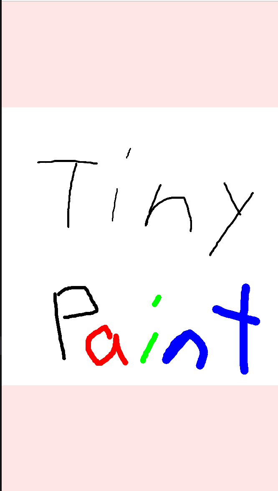
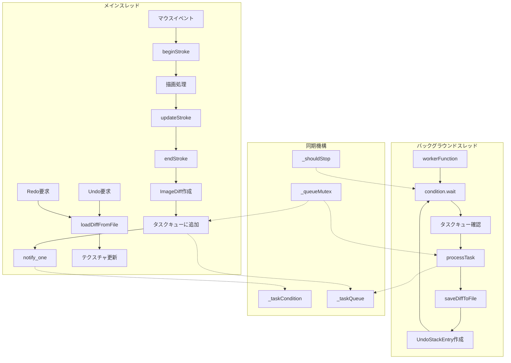
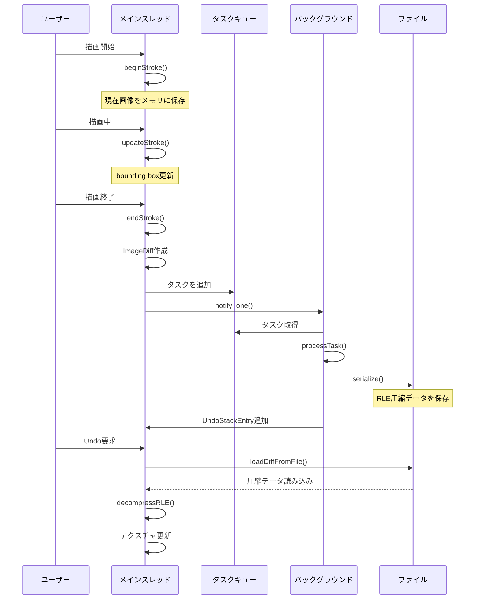

# TinyPaint 🎨

---

### **Colors**

* **White (0):** Eraser 🧼 (Overwrites with the background color)
* **Black (1):** Standard drawing color
* **Red (R):** Red drawing color
* **Green (G):** Green drawing color
* **Blue (B):** Blue drawing color

---

### **Brush Size**

Select a size from **2 to 8** to directly set the brush size.

* Current size: **30px**
* Range: **5px - 120px**

---

### **Controls**

| Action        | Key(s) / Mouse                 |
| :------------ | :----------------------------- |
| **Draw** | Left mouse drag 🖱️             |
| **Undo** | `Ctrl + Z`                     |
| **Redo** | `Ctrl + Shift + Z` or `Ctrl + Y` |
| **Save PNG** | `S`                            |
| **Save XPM** | `X`                            |

---

## TinyPaint's Featur ✨

---

### **1. Aspect Ratio is Maintained While Resizing**

Regardless of the window size, you can **adjust the display size while maintaining the aspect ratio** of the images.

<div align="center">
     
</div>

---

### **2. Supports minilibx XML File Extension**

Great news for minilibx users: you can save images in the XML format (`*.xml`) by pressing the **X key**.

<div align="center">
    
</div>

# Undo/Redoシステム設計とスレッド流れ分析

## 1. メインスレッドとバックグラウンドスレッドの流れ

### システム構成図



### 詳細な処理流れ

#### メインスレッドの処理流れ

**1. 描画開始時 (beginStroke)**
- マウスボタンプレス
- 現在の画像をバッファに保存
- `_isStrokeActive = true`
- bounding box初期化

**2. 描画中 (updateStroke)**
- マウス移動イベント
- 描画処理実行
- bounding box更新

**3. 描画終了時 (endStroke)**
- マウスボタンリリース
- 現在の画像を読み取り
- RLE圧縮でbefore/afterデータ作成
- ImageDiff作成
- タスクキューに追加 + notify

#### バックグラウンドスレッドの処理流れ

**1. 待機状態**
- `condition_variable.wait()`
- タスクキューが空でない または `shouldStop == true` まで待機

**2. タスク処理**
- キューからタスク取得
- ロック解除
- ファイルへの書き込み
- UndoStackEntry作成・追加

## 2. Undo・Redoの工夫

### 主要な最適化手法

#### 2.1 差分圧縮による容量削減

**RLE（Run-Length Encoding）圧縮**
- 連続する同じ色のピクセルを `[長さ, R, G, B, A]` の5バイトで表現
- 大きな単色領域で大幅な容量削減を実現

**圧縮効果の例：**
- 通常：連続する赤いピクセル10個 = 10 × 4 = 40バイト
- RLE：`[10, 255, 0, 0, 255]` = 5バイト（**87.5%削減**）

#### 2.2 Bounding Box最適化

**変更領域の限定**
- 描画されていない領域は保存対象から除外
- マージン5ピクセルを追加して安全性を確保
- 実際に変更された領域のみを対象とすることで、データサイズを大幅削減

#### 2.3 非同期処理によるレスポンス向上

**メインスレッドのブロッキング回避**
- ファイルI/Oをバックグラウンドで実行
- 描画操作の応答性を維持
- ユーザーは重い保存処理を待つことなく、連続して描画可能

#### 2.4 メモリ効率的なデータ管理

**階層的データ構造**
```
UndoSystem
├── UndoStackEntry (メタデータのみ)
│   ├── fileOffset      (ファイル内の位置)
│   ├── dataSize        (データサイズ)
│   └── isValid         (有効フラグ)
└── ファイルシステム (実データ)
    └── .undo_stack.dat (RLE圧縮された差分データ)
```

### データ流れのシーケンス



## 3. 技術的な工夫点

### 3.1 スレッドセーフティ

**同期メカニズム**
- `std::mutex _queueMutex` : タスクキューの排他制御
- `std::condition_variable _taskCondition` : スレッド間通信
- `std::atomic<bool> _shouldStop` : 安全な終了制御

### 3.2 履歴の分岐対応

**Redoチェーンの無効化**
- 新しい操作が行われた時点で、それ以降のRedo履歴を無効化
- 履歴の分岐を適切に管理することで、データの整合性を保証

### 3.3 容量制限機能

**メモリとディスク容量の管理**
- 最大200レベルの履歴制限（`MAX_UNDO_LEVELS`）
- 古い履歴の自動削除
- ファイルサイズの監視機能

### 3.4 部分更新によるパフォーマンス最適化

**最小限のテクスチャ更新**
- 変更された領域のみを更新する`glTexSubImage2D`を使用
- 全体を再描画する必要がなく、大幅なパフォーマンス向上を実現

## 4. システムの利点

### パフォーマンス面
1. **高速な応答性** : メインスレッドが重いI/O処理でブロックされない
2. **メモリ効率** : RLE圧縮により大幅な容量削減
3. **スケーラビリティ** : 大きな画像（4096×4096）でも効率的に動作

### 安定性面
4. **安定性** : スレッドセーフな設計による安全な並行処理
5. **データ整合性** : 履歴の分岐とマージに対応した堅牢な設計

### ユーザビリティ面
6. **直感的な操作** : 標準的なCtrl+Z/Ctrl+Yキーバインド
7. **リアルタイム性** : 描画操作が履歴保存処理に影響されない

このシステムは、リアルタイム描画アプリケーションに求められる高いパフォーマンスと信頼性を両立させた、非常に優秀な設計となっています。