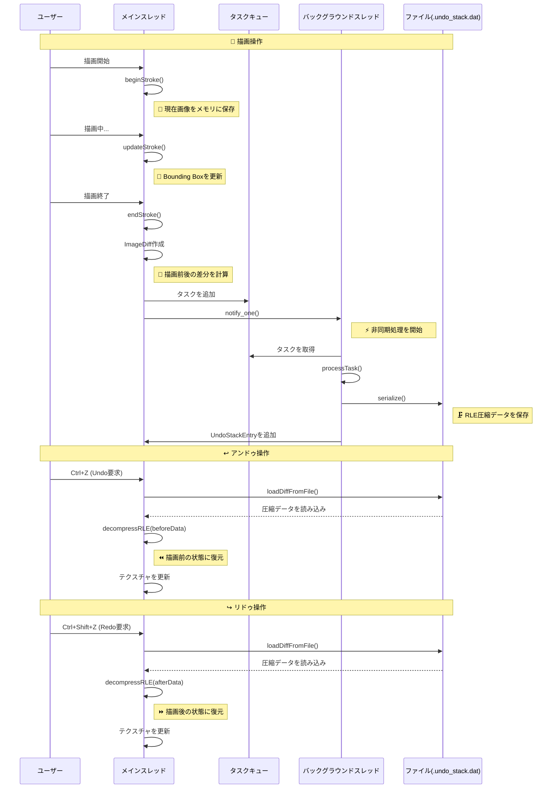

# TinyPaint 🎨

---

### **Colors**

* **White (0):** Eraser 🧼 (Overwrites with the background color)
* **Black (1):** Standard drawing color
* **Red (R):** Red drawing color
* **Green (G):** Green drawing color
* **Blue (B):** Blue drawing color

---

### **Brush Size**

Select a size from **2 to 8** to directly set the brush size.

* Current size: **30px**
* Range: **5px - 120px**

---

### **Controls**

| Action     | Key(s) / Mouse                 |
| :--------- | :----------------------------- |
| **Draw** | Left mouse drag 🖱️             |
| **Undo** | `Ctrl + Z`                     |
| **Redo** | `Ctrl + Shift + Z` or `Ctrl + Y` |
| **Save PNG** | `S`                            |
| **Save XPM** | `X`                            |

---

## TinyPaint's Features ✨

---

### **1. Aspect Ratio is Maintained While Resizing**

Regardless of the window size, you can **adjust the display size while maintaining the aspect ratio** of the images.

     

---

### **2. Supports minilibx XML File Extension**

Great news for minilibx users: you can save images in the XML format (`*.xml`) by pressing the **X key**.

    

---

## Undo/Redoシステム設計とスレッドフロー

---

### **Undo/Redoの最適化**

#### **1. 差分圧縮による容量削減**

**RLE（Run-Length Encoding）圧縮**
-   連続する同じ色のピクセルを `[長さ, R, G, B, A]` の5バイトで表現します。
-   大きな単色領域で大幅な容量削減を実現します。

**圧縮効果の例：**
-   通常：連続する赤いピクセル10個 = 10 × 4 = 40バイト
-   RLE：`[10, 255, 0, 0, 255]` = 5バイト（**87.5%削減**）

#### **2. Bounding Boxによる最適化**

**変更領域の限定**
-   描画されていない領域を保存対象から除外します。
-   安全のために5ピクセルのマージンを追加します。
-   実際に変更された領域のみを対象とすることで、データサイズを大幅に削減します。

#### **3. 非同期処理によるレスポンス向上**

**メインスレッドのブロッキング回避**
-   ファイルI/Oをバックグラウンドスレッドで実行します。
-   描画操作の応答性を維持し、ユーザーは重い保存処理を待つことなく連続して描画できます。

---

### **システムの流れ**

